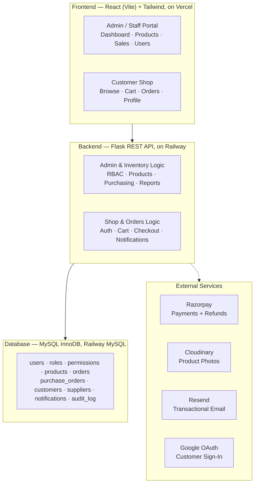

# StockPilot

**Enterprise inventory management with a full customer storefront** — built as an academic project, structured like a real product.

StockPilot started as a database-and-transactions exercise and grew into a two-sided system: a role-secured admin platform for running inventory, sales, and purchasing, paired with a public-facing shop where customers browse, pay, and get their orders fulfilled — all backed by the same audited, transactional database.

**Live:** [Shop](https://inventory-management-system-three-teal.vercel.app/shop) · [Admin Login](https://inventory-management-system-three-teal.vercel.app/login) · [API](https://inventory-management-system-production-702e.up.railway.app/health)

---

## What this actually is

Two portals sharing one backend and one database:

- **Admin / Staff portal** — inventory, products, purchasing, sales, users, reports, all gated by real role-based permissions, not hardcoded role checks.
- **Customer shop** — guest browsing, three login methods, real payments, refund requests, verified-purchase reviews.

Nothing in either portal bypasses the other's audit trail. A customer's payment is verified server-side before it's trusted. A refund goes through a request-and-approve flow before real money moves. Stock only enters the system through a Purchase Order that's actually been received — there's no back door that lets a number change without a record of why.

---

## Architecture



---

## Key features

### Access control
- Real RBAC — `users`, `roles`, `permissions`, `role_permissions` tables, enforced by a `@require_permission` decorator on every protected route, never a hardcoded `if role == 'admin'`
- Granular permissions like `products.update`, `orders.refund`, `dashboard.financials` — Staff, Manager, and Admin each see a genuinely different app, not the same UI with things hidden
- Customer accounts are structurally protected from being promoted into staff roles

### Inventory & purchasing
- Full product CRUD with multi-photo galleries (Cloudinary) — upload several photos per product, pick which one's primary
- Stock changes are audited, not editable — `stock_quantity` is deliberately excluded from the product edit form; every change goes through a logged Stock In/Out/Adjust transaction
- **Purchase Orders are the only way stock enters the system** — a supplier, a cost, and a payment status are attached to every unit added, with the product list filtered per-supplier so you can't order the wrong company's item
- Low stock alerts, full transaction history, CSV export

### Sales & fulfillment
- Full order lifecycle: **Pending → Processing → Completed**, with stock deducted at the moment an order is actually approved, not when it's requested
- Real-time staff notifications (order requests, refund requests, low stock) with a live unread badge
- Two-sided payment reminder system — customers who owe money and vendors who are owed, each with their own configurable follow-up interval

### Payments (real, not simulated)
- Razorpay integration — customers pay through Razorpay's own secure widget; card details never touch this server
- Server-side signature verification on every payment — the frontend reporting "success" is never trusted on its own
- A **webhook safety net** independent of the customer's browser — if a payment succeeds but the client-side confirmation never arrives (closed tab, dropped connection), the webhook still marks it paid
- Refunds go through a **request-and-approve flow**: the customer states a reason, staff reviews and approves before any money actually moves — not a unilateral button

### Customer shop
- Guest browsing by default — the site's own root URL leads to the shop, not a staff login wall
- Three ways to sign in: email/password, phone/password, or Google OAuth
- Full photo gallery + description in a product detail popup, with **verified-purchase reviews** — you can only review something you actually received
- Cart, checkout, delivery details, order cancellation, and a customer-facing "Pay Now" retry if a payment gets interrupted
- A self-service profile page

### Trust & correctness
- 12 database triggers write every insert/update/delete to a real `audit_log` automatically
- Every multi-step write runs through a single `execute_transaction()` helper with automatic rollback on failure
- **Automated tests** (`pytest`) prove the transaction rollback actually works — not just that it's supposed to — alongside RBAC enforcement and input validation checks

---

## Tech stack

| Layer | Technology |
|---|---|
| Frontend | React (Vite) + Tailwind CSS |
| Backend | Python / Flask |
| Database | MySQL (InnoDB) |
| Auth | Bearer tokens (itsdangerous) + bcrypt, Google OAuth |
| Payments | Razorpay (signature-verified + webhook-backed) |
| Media | Cloudinary |
| Email | Resend (custom domain) |
| Hosting | Vercel (frontend) · Railway (backend + MySQL) |
| Testing | pytest |

---

## Getting started locally

```bash
git clone https://github.com/Kunal8954/Inventory-management-system.git
cd Inventory-management-system
```

**Backend**
```bash
cd backend
python3 -m venv venv && source venv/bin/activate
pip install -r requirements.txt --break-system-packages
cp .env.example .env   # fill in DB credentials, Resend/Cloudinary/Razorpay/Google keys
python3 app.py
```

**Frontend**
```bash
cd frontend
npm install
npm run dev
```

**Database**
```bash
mysql -u <user> -p -e "CREATE DATABASE ims"
mysql -u <user> -p ims < backend/schema.sql
```

**Running the tests**
```bash
cd backend
export TEST_STAFF_TOKEN="<a valid staff bearer token>"
python3 -m pytest test_app.py -v
```

---

## Design decisions worth knowing about

A few things that were deliberate, not accidental:

- **Stock quantity isn't in the product edit form.** It's tempting to let admins just type a new number — but that bypasses the audit trail. Stock only moves through logged Stock In/Out/Adjust actions.
- **Refunds require a customer-stated reason and staff approval**, not a direct button. Real money moving deserves a real review step.
- **The payment webhook exists because client-side confirmation alone isn't reliable.** A closed browser tab shouldn't mean a paid order sits marked unpaid forever.
- **Direct "Stock In" was retired once Purchase Orders could actually track suppliers and payment.** Keeping both would have made the formal purchasing process optional in practice.
- **Product reviews require a `Completed` order containing that product.** Anyone can *say* they bought something; only a real order can prove it.

---

## Planned extensions

Two things were deliberately scoped out, not missed:

- **True multi-tenant architecture** — isolating multiple independent businesses on one deployment. This needs its own properly planned effort (a `business_id` boundary across ~15 tables and every route), scoped as a future capstone project rather than a retrofit.
- **Supplier payouts via RazorpayX** — actually sending money to vendors, not just recording that they were paid. This needs a real business bank account and its own KYC, so it's deferred until there's an actual business funding it.

---

## Contributors

Built by **Kunal Sharma** and **Dipanshu Vaghmarey**.

---

## Links

- [GitHub Repository](https://github.com/Kunal8954/Inventory-management-system)
- [Live Shop](https://inventory-management-system-three-teal.vercel.app/shop)
- [Live Admin](https://inventory-management-system-three-teal.vercel.app/login)